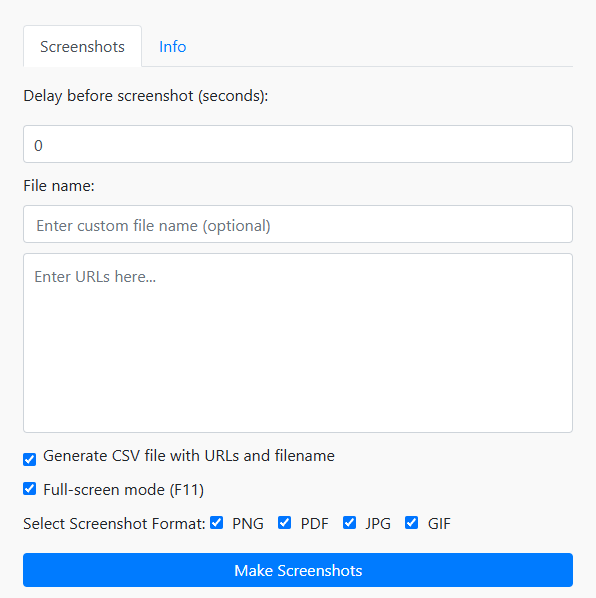

# MultipleScreenshots

**MultipleScreenshots** is a versatile Chrome extension designed to streamline the process of capturing screenshots from multiple URLs effortlessly. With this extension, users can paste a list of URLs, and MultipleScreenshots will open each one, take a screenshot, and save it according to your specified preferences.

---

## Key Features

- **Customizable Delay**: Set a delay (in seconds) before capturing screenshots to ensure pages load fully.
- **Flexible File Names**: Specify custom file names or use default naming conventions.
- **Multiple Screenshot Formats**: Save screenshots in PNG, JPG, PDF, or GIF formats.
- **CSV Generation**: Automatically create a CSV file mapping URLs to their corresponding filenames.
- **Full-Screen Mode**: Take screenshots in full-screen mode for better visibility.

---

## Installation

1. Go to the Chrome Web Store page for **MultipleScreenshots**:
   [chrome://extensions/](https://chromewebstore.google.com/detail/multiplescreenshots/gbgeckhegkbgdlfpcgjdhdckdfcimmbc).
2. Click **Add to Chrome** to install the extension.

---

## Usage

1. Open the extension popup.
2. Enter the list of URLs in the provided text area.
3. Configure the desired options:
   - Delay (in seconds)
   - Screenshot formats
   - File naming conventions
4. Click the **Make Screenshots** button to start the process.

---

## Screenshots

---

## License

This project is licensed under the [Creative Commons Attribution-NonCommercial-NoDerivatives 4.0 International License](LICENSE).

---

## Creator
For inquiries or feedback, please contact me at [kontakt@wentago.pl].

---

## Support & Donations

If you find **MultipleScreenshots** helpful, please consider supporting its development by making a donation. Your support helps keep the coffee flowing and the updates coming! ☕

---
