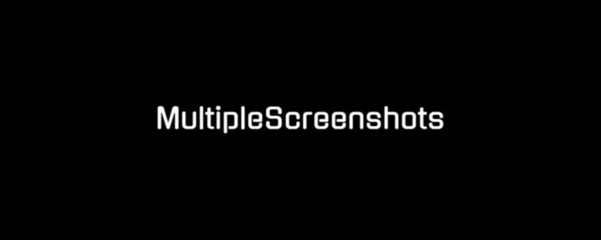

**MultipleScreenshots** is a versatile Chrome extension designed to streamline the process of capturing screenshots from multiple URLs effortlessly. With this extension, users can paste a list of URLs, and MultipleScreenshots will open each one, take a screenshot, and save it according to your specified preferences.

---

## Key Features

- **Customizable Delay**: Set a delay (in seconds) before capturing screenshots to ensure pages load fully.
- **Flexible File Names**: Specify custom file names or use default naming conventions.
- **Multiple Screenshot Formats**: Save screenshots in PNG, JPG, PDF, or GIF formats.
- **CSV Generation**: Automatically create a CSV file mapping URLs to their corresponding filenames.
- **Path Column in CSV**: Add an optional column in the CSV to specify the full file path for easier organization.
- **URL & Timestamp Overlay**: Add a URL and timestamp overlay to your screenshots for reference.
- **Full-Screen Mode**: Take screenshots in full-screen mode for better visibility.
- **Full-Page Mode**: Take screenshots of full page.
- **Clip to XPath**: Crop screenshots to a specific element by providing its XPath.
- **Visual XPath Picker Tool**: Click a button to visually select an element on a webpage. The extension captures its XPath and makes it available for cropping screenshots.
---

## Installation

1. Go to the Chrome Web Store page for **MultipleScreenshots**:
   [chrome://extensions/](https://chromewebstore.google.com/detail/multiplescreenshots/gbgeckhegkbgdlfpcgjdhdckdfcimmbc).
2. Click **Add to Chrome** to install the extension.

---

## Feature Guide

### 1. Delay

Set the delay (in seconds) before capturing each screenshot. Useful for pages that take longer to load.

### 2. Custom Names

#### a) URL as filename

Use the full URL (hostname + path) as the filename for easy identification.

#### b) Domain as filename

Generate filenames based solely on the URL domain to simplify file organization.

#### c) Custom name

Enter your custom filename prefix, which will be applied to all screenshots.

---

### 2. Fullscreen

Enable this option to capture screenshots in Chrome's fullscreen mode (F11), ensuring cleaner visuals.

### 3. Fullpage

Activate this option to capture the entire webpage content, including parts not visible on screen. This feature automatically scrolls through the page to capture all content.

### 4. URL & Timestamp Overlay

Add the webpage URL and timestamp directly to the screenshot image, useful for documentation or audits.

### 5. Formats

Select one or multiple screenshot output formats: PNG, JPG, PDF, or WEBP.

### 6. Path (Settings Tab)

Specify a custom path for your screenshot downloads in the <strong>Settings</strong> tab. Remember, this path should match Chrome’s download directory. It only adds the path text itself and connects it to the file name in the generated csv. If we provide the same path that we have set in Chrome Downloads, it makes it easier to create file paths and the entire analysis.
 

---

### 7. XPath Settings
In the Settings tab, you can:
- Manually enter an XPath and save it with a label for future use.
- Use the Select XPath Manually button to visually pick an element on the currently active page — the XPath will be auto-filled and can be saved with a custom name.

  
### 8. XPath Picker Tool
The Select XPath Manually button allows you to visually select any element on the open webpage:
- Hover will highlight elements.
- Click to select — the XPath is automatically retrieved.
- A confirmation alert appears, and the XPath is auto-filled back into the extension interface (even after reopening).
- You can then save it under a custom label for repeated use.

  
### 9. Clip image to XPath (Crop Screenshot to Element)
Use this feature to crop the screenshot to a specific part of the page by:
- Selecting a saved XPath from the dropdown.

Enable the "Clip image to XPath" checkbox. The extension will attempt to crop the screenshot to the selected element.
- If the XPath exists on the page, the screenshot will be cropped precisely.
- If the XPath is not found, a normal screenshot will be taken instead as fallback.

### 10. Highlight element on screenshot (Highlight element by xpath)
Use this feature to highlight chosen element on screenshot:
- Selecting a saved XPath from the dropdown.

Enable the "Highlight element by xpath" checkbox. The extension will attempt to scroll into chosen element by xpath and make the screenshot with framed selected element.
- If the XPath exists on the page, the screenshot will frame element precisely.
- If the XPath is not found, a normal screenshot will be taken instead as fallback.

---

### 10. Generate CSV

Automatically create a CSV file mapping each URL to its screenshot filename and optionally the full file path, ideal for batch processing and record keeping.

---

## License

This project is licensed under the [Creative Commons Attribution-NonCommercial-NoDerivatives 4.0 International License](LICENSE).

---

## Creator
For inquiries or feedback, please contact me at [kontakt@wentago.pl].

---

## Support & Donations

If you find **MultipleScreenshots** helpful, please consider supporting its development by making a donation. Your support helps keep the coffee flowing and the updates coming! ☕

---
